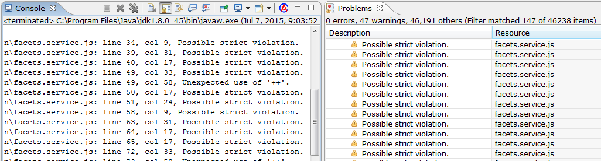

# Frontend Maven Plugin Console Support

This plugin parses the errors in Eclipse consoles (Process Console or Maven Console) and converts them to hyperlinks. It also adds warnings and error markers as applicable.

